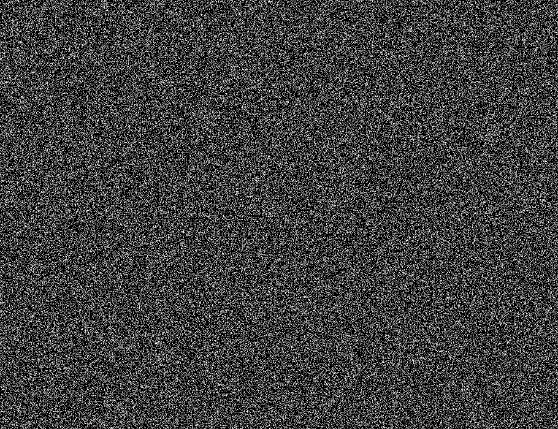
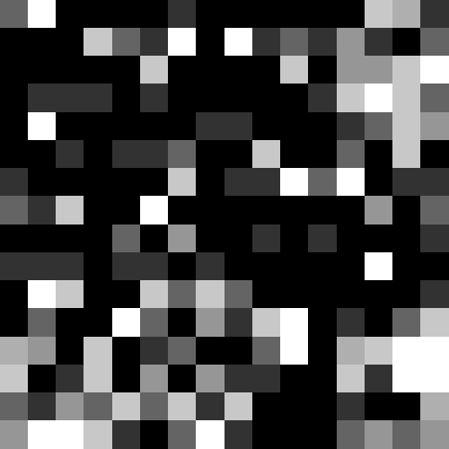
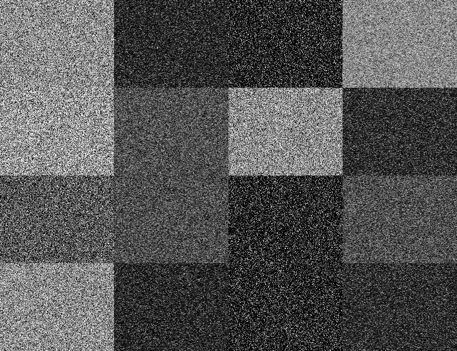
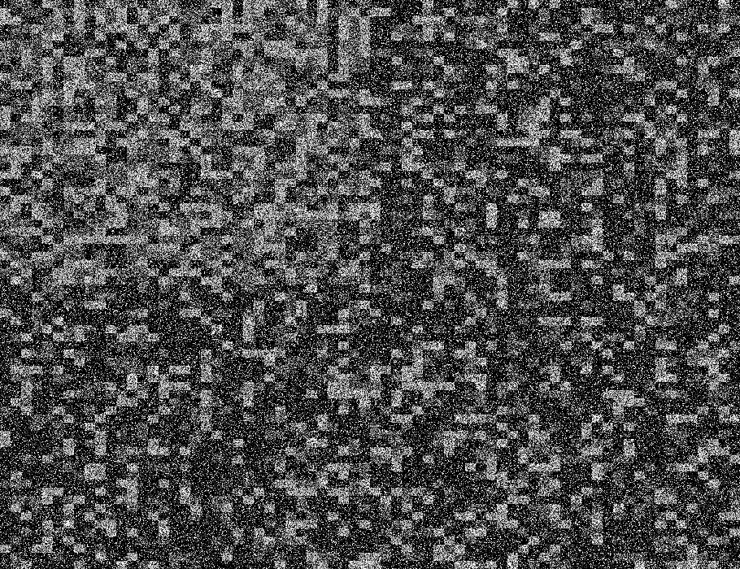

# Recoding

This project's goal is to find an algorithm similar to the one used by Karl Otto Göt for his *Density 10: 3: 2: 1* (1959-61), using JavaScript's P5 library.

## TEST 1
-> index_V1.html + sketch_V1.js

## TEST 2
-> index_V2_1.html + sketch_V2_1.js

-> index_V2_2.html + sketch_V2_2.js

## TEST 3 --- FINAL VERSION
-> index_Final.html + sketch_Final.js

